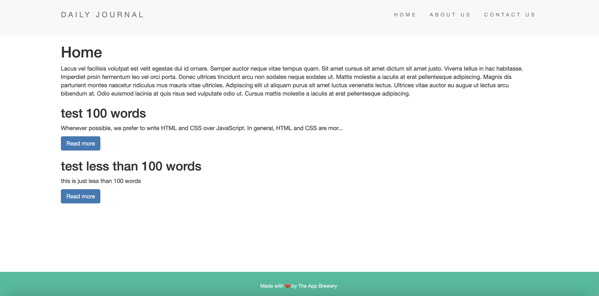

# Blog-website-EJS-Challenge-The-App_Brewery-WebDevCourse
 Blog website EJS Challenge: The App Brewery WebDevCourse 2023
 
 This Repository is a part of The Complete 2023 Web Development Bootcamp by The App Brewery, tought by Dr. Angela Yu.
 
# To Start Web Server
#### 1. Go to directory where you store the files
```
cd {directory}
```

#### 2. Install npm packages
```
npm install
```

#### 3. Run Web Server
```
node app.js
```
if you have "nodemon" installed:
```
nodemon app.js
```


